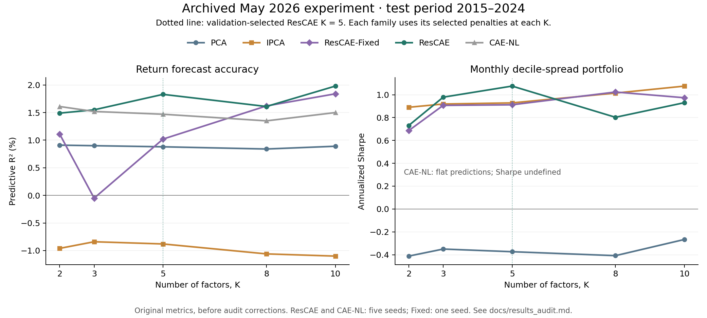

# Latent Factor Models

A research project comparing PCA, instrumented PCA (IPCA), a plain autoencoder, and three conditional autoencoder architectures on monthly stock returns. The main question is whether a flexible correction to characteristic-based factor loadings improves held-out return forecasts.

**Results status:** the committed empirical results are an archived May 2026 experiment. A September 2026 review corrected data preparation, training, evaluation, and reporting bugs. The full empirical grid has **not** been rerun with those corrections. Treat the archived numbers as exploratory evidence; read the [results audit](docs/results_audit.md) before citing them.

## What the archived experiment found

The archived data contain 486 stocks and 539 months. The split is February 1980–December 2009 for training, January 2010–December 2014 for validation, and **January 2015–December 2024 for testing (120 months)**.

The ResCAE configuration selected by validation predictive MSE is **K = 5, λ_linear = 0.1, λ_nonlinear = 0.00005**. At that factor dimension, the archived summary reports:

| Model | Reconstruction R² | Predictive R² | Annualized decile-spread Sharpe |
| :--- | ---: | ---: | ---: |
| PCA | 26.23% | 0.88% | −0.374 |
| IPCA | 9.15% | −0.88% | 0.929 |
| ResCAE-Fixed | 18.11% | 1.02% | 0.912 |
| ResCAE | 17.83% | **1.83%** | **1.076** |
| CAE-NL | 15.52% | 1.47% | Undefined: flat predictions |

Source: [archived summary](results/05-14-2026-1407/summary_table.csv). ResCAE and CAE-NL average five seeds in that run; ResCAE-Fixed uses one seed. The plain AE was trained but omitted from the old summary, so its historical comparative performance cannot be established from that table.



These results suggest a forecasting benefit for the residual architecture, with several qualifications:

- At the validation-selected K = 5, archived two-sided Diebold–Mariano p-values are 0.0282 versus PCA and 0.0120 versus IPCA. These are the original, unadjusted tests, before the review's corrections.
- The K = 10 ResCAE has the highest reported test predictive R², 1.98%. It was **not** the configuration selected by validation. Choosing it after inspecting the test set overstates the evidence for a selected model.
- Better return-level forecasts do not imply better portfolio rankings. IPCA has negative predictive R² but positive portfolio Sharpe. The ResCAE–IPCA Sharpe difference at K = 5 is not significant in the archived bootstrap test (p = 0.133).
- ResCAE-Fixed improves on IPCA at the 5% level for two of five factor dimensions, not “most.” Its encoder is still trained, so this comparison does not isolate nonlinearity while holding factors fixed.
- Flat CAE-NL predictions can approximate an overall mean return and achieve positive predictive R² while offering no useful cross-sectional ranking.

## Models and prediction protocol

Let `z[i,t]` be characteristics available through month `t−1`, `β[i,t]` the factor loadings, and `f[t]` the latent factors.

| Model | Loading/decoder structure | Forecast |
| :--- | :--- | :--- |
| PCA | Static principal-component directions | Training mean returns projected into the K-component space; constant over test months |
| IPCA | `β[i,t] = Γ z[i,t]`, fitted by alternating least squares | Loadings times the mean fitted training factor |
| AE | Full-return-vector encoder `N → 128 → 64 → K`; mirrored decoder | Decoder applied to the mean training encoding; constant over test months |
| ResCAE | `β[i,t] = W_skip z[i,t] + g(z[i,t])` | Loadings times the mean training encoding |
| ResCAE-Fixed | Same decoder, with `W_skip` frozen at fitted IPCA weights | Same forecast rule; encoder and `g` are trained |
| CAE-NL | `β[i,t] = g(z[i,t])`; no linear skip branch | Same forecast rule |

The conditional encoder takes characteristic-managed returns, `Z[t]ᵀ r[t] / N[t]`, through a `P → 32 → K` network. The loading network `g` is `P → 32 → 32 → K`, with ReLU hidden activations. ResCAE initializes its linear weights from the corresponding fitted IPCA model and initializes `g` with small weights.

**Reconstruction and forecasting are separate operations.** Reconstruction encodes realized test-month returns to measure fit. Forecasts use the training factor mean and lagged characteristics; they do not encode realized test returns. Parameters and factor means are not updated during the test period.

Training uses Adam, learning rate `0.001`, monthly batches of 32, gradient clipping at norm 1, and early stopping on validation reconstruction MSE. A separate full-training-sample step penalizes deviations of `FᵀF/T` from the identity, with weight `0.001`. This encourages scale and orthogonality; it does not eliminate rotational indeterminacy. Epoch selection uses reconstruction loss; hyperparameter selection uses **validation predictive MSE**. Training is not repeated on the combined training and validation periods.

## Installation

Run commands from the repository root. The reviewed environment used Python 3.14.3, NumPy 2.4.4, pandas 3.0.3, SciPy 1.17.1, and PyTorch 2.11.0. Dependencies are minimum bounds rather than a frozen lockfile; each new run records its installed versions.

```bash
python3 -m venv .venv
source .venv/bin/activate
python -m pip install -r requirements.txt
```

## Run the project

Start with a small **offline synthetic check**. It exercises all six model families and produces tables, figures, and a checkpoint; its short training schedule is for software verification.

```bash
python main.py --smoke-test
```

Run the full empirical experiment with one seed:

```bash
python main.py --device cpu
```

On the first empirical run, the project downloads the current S&P 500 constituent list from Wikipedia, adjusted prices/volume and shares from Yahoo Finance through `yfinance`, and the TB3MS interest-rate series from FRED. No API key is configured. Network access and source availability are required. Data are cached locally and are not included in this repository.

Run the full grid with five seeds for **each** conditional architecture:

```bash
python main.py --multi-seed --seeds 10 30 45 99 2048
```

Default grids:

- `K`: 2, 3, 5, 8, 10
- `λ_linear`: 0.001, 0.005, 0.01, 0.05, 0.1
- `λ_nonlinear`: 0.000001, 0.00001, 0.00005, 0.0001, 0.0005
- Maximum epochs: 400; early-stopping patience: 25

The full grid contains 125 ResCAE, 25 ResCAE-Fixed, and 25 CAE-NL configurations. Five seeds require **875 conditional-network fits**, plus five AE fits and the PCA/IPCA baselines. This can take substantial time. PCA/IPCA fits are reused for warm starts. In multi-seed mode, selection minimizes mean individual-seed validation predictive MSE, and final predictions are averaged across seeds; this is not selection by ensemble validation MSE. PCA, IPCA, and AE are not ensembled.

Use a smaller empirical run while developing:

```bash
python main.py --k 2 --lambda-lin 0.001 --lambda-nonlin 0.00001 \
  --max-epochs 20 --patience 5 --bootstrap-samples 100
```

`--device cuda` and `--device mps` are supported when available. CPU execution is the verified path. `--threads` controls PyTorch CPU threads and defaults to 1. `--figures-dir` overrides the plot destination; `--run-dir` chooses a new output directory. Existing run directories are protected from accidental retraining overwrite.

Re-evaluate a completed run from its trusted checkpoint, supplying the same data options:

```bash
python main.py --skip-train --run-dir results/YOUR_RUN \
  --cache data/raw/data_cache_v2.pkl
```

For a synthetic checkpoint, include `--smoke-test` and its original `--seed`. The data fingerprint must match. Re-evaluation replaces tables/plots in that run and writes `evaluation_output.txt` and `evaluation_config.json`; it preserves the original training log/configuration. Checkpoints and caches contain Python objects: load only files you trust. The archived May run has no model checkpoints and cannot be re-evaluated this way.

Use `python main.py --help` for all options.

## Data and limitations

New runs use `data/raw/data_cache_v2.pkl` and separate versioned download caches. The old `data_cache.pkl` is rejected by default. `--cache data/raw/data_cache.pkl --allow-legacy-cache` permits historical diagnostics explicitly; it does not repair the old characteristics.

The target is monthly adjusted-price stock returns minus an approximate monthly risk-free rate. TB3MS is converted using `(1 + rate/100)^(1/12) − 1`; this is an approximation, not a realized Treasury holding-period return. Monthly price gaps are forward-filled for at most three months. Stocks require at least 60 observed monthly returns over the full sample.

The 21 features are cross-sectionally ranked to `[-1, 1]` each month:

| Group | Features |
| :--- | :--- |
| Momentum | `mom1`, `mom3`, `mom6`, `mom9`, `mom12`, `mom36` |
| Volatility | `vol1`, `vol6`, `vol12`, `ivol12` |
| Market exposure | `beta12`, `beta36`, `beta_down` |
| Size/price | `log_mktcap`, `high52` |
| Daily-return shape | `max_ret`, `min_ret`, `skew1`, `skew3` |
| Liquidity/activity | `amihud`, `turn1` |

`mom1` uses the preceding month; the shorter multi-month momentum windows skip that month. The legacy name `mom36` denotes a 24-month older-return window, `returns[t−37:t−13]`, not a trailing 36-month cumulative return. `vol1` scales daily volatility by `sqrt(21)` to monthly units. Missing feature histories remain missing; complete feature vectors determine eligibility for conditional models. The new evaluation applies that same eligible test panel to all families.

This is an exploratory dataset, with material limits:

- The universe is today's S&P 500 list, not historical membership. Delisted firms are absent, and the full-sample observation filter uses future coverage information.
- Shares history can be unavailable. The downloader falls back to current shares outstanding across historical dates, introducing look-ahead bias. Adjusted prices also make size/dollar-volume features approximations. Lagging the resulting features does not remove these source-data biases.
- Daily/long-window characteristics reduce effective training coverage. The archived cache has 359 calendar training months but only 299 with at least one complete return/characteristic observation.
- There is one held-out period, many tested configurations, and no transaction costs, short-borrow costs, turnover constraints, or financing model. The long-short spread is long one unit and short one unit, with gross exposure two.
- The flexible decoder has biases and can learn linear or constant effects as well as nonlinear ones. Freezing `W_skip` alone does not identify a unique nonlinear residual or rule out calibration/encoder effects.

## Reading the outputs

Every new run writes `results/YYYY-MM-DD-HHMMSS-microseconds/` (synthetic runs have a `smoke-` prefix):

| File | Contents |
| :--- | :--- |
| `config.json` | Training arguments, package versions, split dates, Git state, data fingerprint |
| `evaluation_config.json` | Evaluation settings and source hashes |
| `summary_table.csv` | Full-precision metrics for validation-selected configurations at each K, including AE |
| `all_config_metrics.csv` | Full grid for descriptive parameter plots; includes selection markers |
| `*_hparam_search.pkl` | Validation scores and selected configuration |
| `*_multiseed_hparam_search.pkl` | Per-seed validation scores, when enabled |
| `seed_stability.csv` | Per-seed test diagnostics for all conditional families, with validation selection markers |
| `significance_tests.pkl` | DM tests and bootstrap results |
| `models/checkpoint.pt` | Complete trained model bundle and data fingerprint; ignored by Git |
| `loss_histories.json` | Recorded training and validation curves |
| `results_summary.txt`, `terminal_output.txt` | Interpretation and execution log |
| `plots/` | PNG and PDF figures |

Metric definitions:

- **Total_R2 / Pred_R2:** `1 − sum((r − r_hat)²) / sum(r²)`, relative to a zero excess-return forecast. The difference is whether `r_hat` reconstructs realized returns or forecasts them. A stored value of `0.0183` is **1.83%**, not 0.0183%.
- **Sharpe:** `sqrt(12) × mean(monthly spread) / sample_std(monthly spread)`. The spread is equal-weight top predicted decile minus bottom predicted decile, requiring at least 20 eligible stocks. Flat signals and overlapping tied deciles produce no portfolio. Missing Sharpe alone does not prove collapse; check `Collapsed` and coverage.
- **CSPE:** root mean squared per-stock mean forecast residual, in monthly decimal return units. Lower is better.
- **NL_frac (φ):** nonlinear loading variance divided by the sum of linear and nonlinear loading variances, averaging within-factor variances over valid stock-months. It omits covariance and is **not** a fraction of explained return variance. For ensembles, component variances are averaged over members before taking the ratio. Flat predictions have undefined φ in the summary.
- **drift_rel:** `||W_skip − Γ_initial||_F / ||Γ_initial||_F`, averaged over seeds for ensembles. Values above 1 are retained. Frozen weights give zero drift; small drift does not establish identification.

New DM reports consistently use a positive statistic to favor the **first named model**, with two-sided normal-approximation p-values and a Bartlett/Newey–West long-run variance estimate. Selected comparisons also receive Holm adjustment across K within each comparison family. Full-grid tests remain exploratory. Bootstrap intervals/tests resample six-month circular blocks, using 1,000 draws by default. The portfolio plot shows an **arithmetic sum** of monthly spreads, not compounded investment wealth.

## Project layout and checks

```text
main.py                       CLI, reproducibility metadata, checkpoints
src/data.py                   Downloads, lagged characteristics, time splits
src/models.py                 PCA/IPCA/AE/CAE implementations
src/train.py                  Training and validation-based grid selection
src/ensemble.py               Prediction averaging and seed diagnostics
src/evaluate.py               Metrics, statistical comparisons, plots
notebooks/exploration.ipynb    Interactive data and archived-summary exploration
tests/test_regressions.py      Offline regression checks
docs/results_audit.md          Findings, corrections, and historical caveats
results/05-14-2026-1407/        Preserved historical outputs
```

```bash
python -m unittest discover -s tests -v
python main.py --smoke-test --multi-seed --seeds 10 30
```

Jupyter is optional and is not in the core requirements. The notebook names its results directory explicitly; edit `RUN_DIR` to inspect another run. Local `data/`, `paper/`, and `notes/` directories are excluded from Git. The paper/notes are archived planning drafts, not a validated manuscript.
